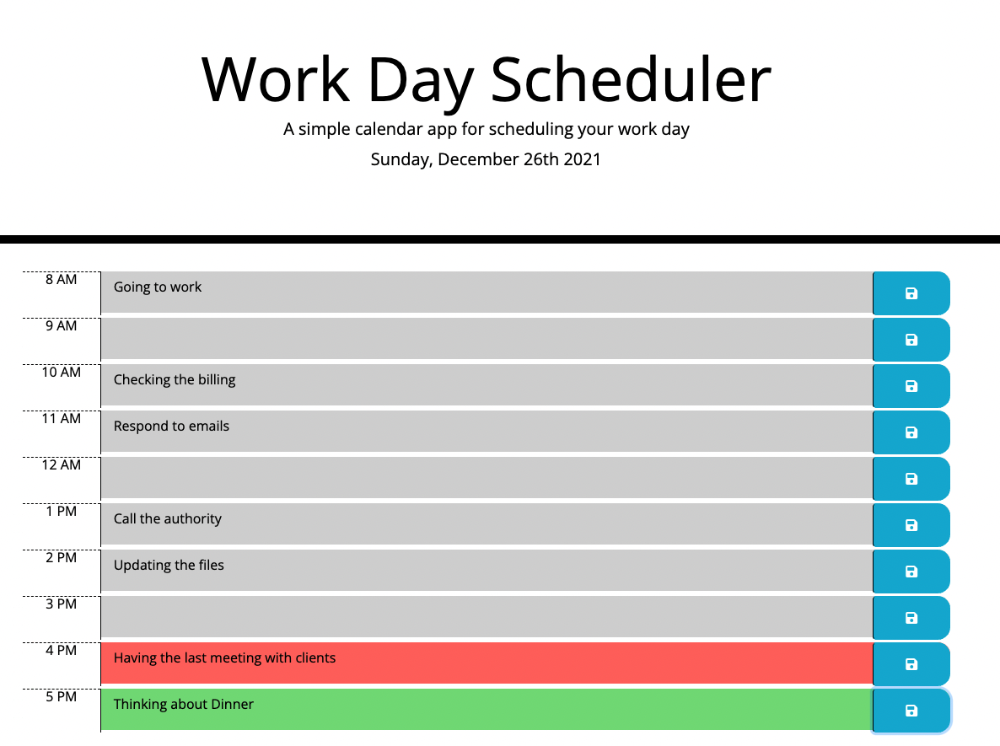

# Work Day Scheduler app
### It is required to accomplish work day scheduler app starting from 8 AM to 5 PM.
### Every day has a line starts with the time and then text area for plan details and icon button to save the plan.
### There are three background colors, for every day will be applied, one if the time is passed the current our and one if the present and one if the time is coming.
## The work included:
### <li> Establishing all the elements in the index.html file, the row for every day and every row includes three columns for the time and plan text and the save button.
### <li> Defining the variables in javascript file.
### <li> Adding the full current date to the header.
### <li> Adding and regulate the background for every hour plan depending on its time and the current time accordingly.
### <li> Saving the plan text in local storage.
### <li> keeping the plan text saved even after refreshing the page.
## I use in this work:
### <li> HTML 
### <li> CSS
### <li> Javascript
  
## Bellow is a screenshot for the app

                                                       
  
### Link of the deployed work
  
https://omarasamarai.github.io/05-challenge/  

  
### Omar Asamarai
